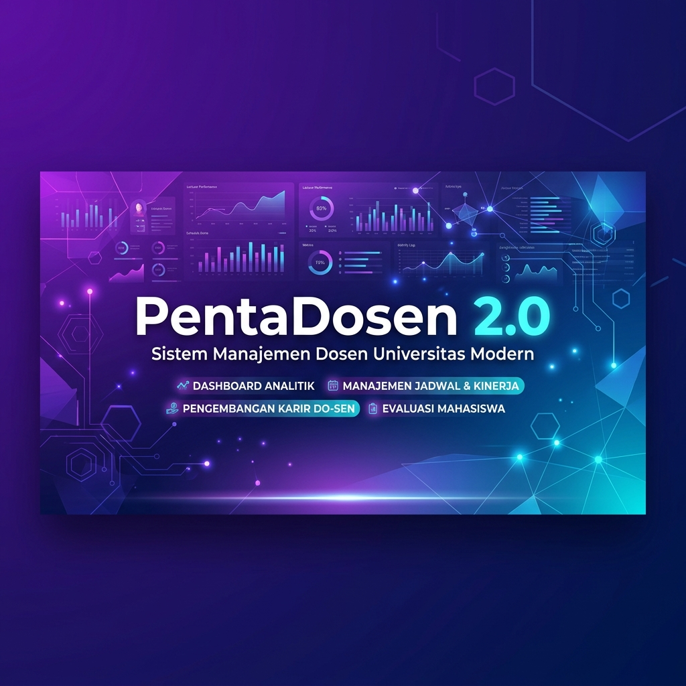

# 🚀 PentaDosen 2.0

<p align="center">
  
</p>

<p align="center">
  
  
  
  
  
</p>

---

**PentaDosen 2.0** adalah sistem dashboard manajemen dokumen dan evaluasi kinerja dosen tingkat lanjut. Mengusung konsep **"High-Tech Academic Workspace"**, platform ini menggabungkan fungsionalitas administrasi akademik yang kuat dengan keindahan antarmuka modern layaknya dasbor developer premium—dilengkapi dengan efek *glassmorphism*, pendaran cahaya halus (*text glow*), serta dukungan penuh untuk **Light Mode** dan **Dark Mode**.

---

## 🎨 Sistem Desain & Estetika UI

Dasbor dirancang dengan fokus pada ketajaman informasi dan visual yang memikat:
*   **Tema Utama:** *High-Tech Academic Workspace* bernuansa modern, futuristik, dan disiplin.
*   **Efek Glassmorphism:** Elemen kartu (*cards*) semi-transparan buram menggunakan teknik *backdrop blur* premium (`backdrop-blur-md`).
*   **Tipografi Presisi:**
    *   **Geist Mono** untuk elemen teks antarmuka, judul, navigasi, dan deskripsi halaman.
    *   **JetBrains Mono** untuk representasi data numerik, persentase statistik, dan kode dokumen agar mudah dibaca.
*   **Sistem Warna Dinamis:** Aksen warna biru elektrik (`#3b82f6`) yang futuristik berpadu dengan tema gelap pekat (`slate-950`) dan terang bersih (`slate-50`).

---

## ✨ Fitur Utama Platform

### 👨‍🏫 Fitur Portal Dosen
*   **📊 Dashboard Interaktif:** Ikhtisar statistik visual pencapaian angka kredit dan status dokumen dalam grafik yang dinamis.
*   **🗄️ Document Vault (Gudang Dokumen):** Repositori terpusat untuk menyimpan, memfilter, dan mengelola berkas akademik yang terbagi atas:
    *   **🔬 Penelitian:** Manajemen berkas penelitian dan proposal.
    *   **📄 Publikasi:** Pengelolaan berkas jurnal ilmiah dan prosiding konferensi.
    *   **🔐 HKI (Hak Kekayaan Intelektual):** Pencatatan paten, hak cipta, dan desain industri.
    *   **📚 Buku:** Arsip penulisan buku ajar, monograf, maupun buku referensi.
*   **👤 Manajemen Profil Akademik:** Kemudahan melihat dan memperbarui informasi identitas akademik dan kepangkatan.
*   **💡 FAQ & Bantuan Terintegrasi:** Panduan interaktif untuk membantu dosen memanfaatkan seluruh fitur sistem.

### 👑 Fitur Portal Administrator (Admin)
*   **📂 Pusat Kontrol Dokumen:** Akses penuh untuk menelusuri, menyaring, dan mengevaluasi seluruh dokumen yang diunggah oleh dosen.
*   **✅ Modul Verifikasi:** Sistem persetujuan (*verify*) atau penolakan (*reject*) pengajuan dokumen dengan fitur pemberian umpan balik (*feedback*) catatan revisi.
*   **👥 Direktori Dosen:** Basis data lengkap dosen untuk memantau performa, riwayat dokumen, serta status keaktifan akademik.
*   **🔄 Modul Sinkronisasi:** Sinkronisasi otomatis data dosen dan publikasi dari sumber eksternal (Google Scholar API, dll).
*   **📝 Log Aktivitas Sistem:** Audit log kronologis yang mencatat setiap aksi administrasi untuk menjaga integritas data.

---

## 🛠️ Ringkasan Teknologi (Tech Stack)

| Teknologi | Fungsi / Peran | Deskripsi |
| :--- | :--- | :--- |
| **⚡ Vite 6** | Build Tool & Dev Server | Menyediakan proses reload kilat dan optimasi bundel produksi. |
| **⚛️ React 19** | UI Library | Kerangka kerja pengembangan antarmuka berbasis komponen menggunakan TypeScript. |
| **🎨 Tailwind CSS 4** | Styling Framework | Framework utility-first modern dengan variabel CSS asli untuk tema dinamis. |
| **🧭 React Router 7** | Routing & Guarding | Navigasi halaman yang lancar di sisi klien dengan proteksi hak akses pengguna. |
| **✨ Motion (Framer)** | Animation Library | Mengatur animasi mikro, transisi halaman, dan efek hover yang responsif. |
| **📈 Recharts** | Data Visualization | Pustaka chart berbasis SVG yang interaktif untuk visualisasi data statistik. |
| **🔧 Lucide React** | Icon Pack | Ikon grafis vektor minimalis yang serasi dengan tipografi sistem. |

---

## 📂 Struktur Folder Proyek

```text
FE-PentaDosen/
├── public/                # Aset media statis (Logo, Banner, dll.)
└── src/
    ├── components/        # Komponen UI global & Reusable
    │   ├── Home/          # Komponen khusus halaman Landing
    │   ├── layout/        # Komponen kerangka dashboard (Sidebar, Header, Shell)
    │   └── ui/            # Komponen dasar atomik (Button, Dialog, Badge, Input)
    ├── lib/               # Utility helper & helper konfigurasi client
    ├── pages/             # Halaman-halaman utama (Views)
    │   ├── admin/         # Modul halaman Administrator (Verification, Sync, Logs, dll.)
    │   ├── auth/          # Alur otentikasi (Login, Register, Sandi)
    │   ├── dosen/         # Modul halaman Dosen (Research, Publication, HKI, Buku)
    │   ├── profilediri/   # Halaman pengaturan profil lengkap dosen
    │   └── Home.tsx       # Landing Page utama
    ├── App.tsx            # Peta rute (Routing) & State global
    ├── index.css          # Pendaftaran CSS sistem desain & Tailwind directive
    └── main.tsx           # Titik masuk (Entry point) React
```

---

## 🚀 Panduan Memulai

Ikuti instruksi berikut untuk menjalankan aplikasi di lingkungan pengembangan lokal Anda.

### 📋 Prasyarat
*   **Node.js** (Versi 18 ke atas sangat direkomendasikan)
*   Paket Manajer **NPM** atau **Yarn**

### 📥 Tahapan Instalasi

Pasang semua pustaka dependensi yang dibutuhkan oleh proyek:
```bash
npm install
```

### 🏃 Menjalankan Aplikasi

Gunakan perintah CLI berikut untuk mengoperasikan aplikasi:

| Perintah | Aksi / Hasil | Keterangan |
| :--- | :--- | :--- |
| `npm run dev` | **Mulai Server Dev** | Menjalankan aplikasi dengan *Hot Module Replacement* di `http://localhost:5173`. |
| `npm run build` | **Pembuatan Paket Produksi** | Mengompilasi dan mengoptimalkan aset agar siap diunggah ke hosting server. |
| `npm run preview` | **Pratinjau Hasil Build** | Menjalankan server lokal untuk menguji bundel produksi sebelum dideploy. |
| `npm run lint` | **Pemeriksaan Kualitas Kode** | Melakukan analisis statis kode untuk menemukan dan memperbaiki kesalahan sintaksis/gaya. |

---

<div align="center">
  <sub>Dibuat dengan ❤️ untuk Manajemen Akademik yang Lebih Baik</sub>
</div>
