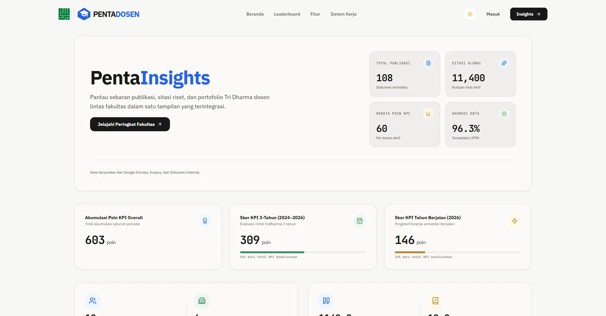

# 🚀 PentaDosen (Frontend)

<p align="center">
  
</p>

<p align="center">
  
  
  
  
  
</p>

---

## 📌 Tentang Platform

**PentaDosen** adalah platform sistem informasi manajemen portofolio dan pelacakan kinerja Tri Dharma Perguruan Tinggi (Pendidikan, Penelitian, dan Pengabdian kepada Masyarakat) untuk dosen di lingkungan **Universitas YARSI**.

Platform ini dirancang khusus untuk mempermudah dosen dalam mendokumentasikan dan memantau perolehan **Poin KPI Akademik** secara otomatis, akurat, dan transparan tanpa proses manual yang memakan waktu. PentaDosen mengintegrasikan data publikasi ilmiah dari pengindeks global seperti **Scopus** dan **Google Scholar**, mengotomatisasi kalkulasi angka kredit berbasis peran kepenulisan (*First Author*, *Corresponding*, *Co-Author*), serta menyediakan tata kelola berkas penelitian, HKI, dan buku ajar dalam satu antarmuka modern yang adaptif.

---

## 🌐 Live Demo

Aplikasi PentaDosen dapat diakses melalui tautan berikut:

| Lingkungan (Environment) | Tautan Akses | Keterangan |
| :--- | :--- | :--- |
| 🏛️ **Production Resmi** | [pentadosen.yarsi.ac.id](https://pentadosen.yarsi.ac.id/) | Domain resmi institusi Universitas YARSI yang digunakan untuk operasional dan penilaian kinerja civitas akademika aktif. |
| 🚀 **Staging / Public Demo** | [www.pentadosen.site](https://www.pentadosen.site/) | Lingkungan demonstrasi publik dan pengujian berkala untuk rilis fitur terbaru sebelum diterapkan ke server utama. |

---

## ✨ Fitur Utama

Fitur-fitur pada PentaDosen dikelompokkan secara terstruktur berdasarkan peran pengguna dan modul analitik:

### 👨‍🏫 1. Portal Dosen
* **Dashboard & KPI Tracker:** Pemantauan real-time ringkasan akumulasi poin KPI, grafik performa riset per tahun, dan status dokumen.
* **Manajemen Publikasi Ilmiah:** Pelacakan otomatis jurnal internasional (terindeks Scopus dengan quartile Q1–Q4) & jurnal nasional (terakreditasi SINTA 1–6), jumlah sitasi, serta konfigurasi status *corresponding author*.
* **Manajemen Penelitian:** Pencatatan proposal dan laporan penelitian berdasarkan skema pendanaan, fokus riset, serta nominal dana disetujui.
* **Manajemen HKI & Paten:** Inventarisasi Hak Kekayaan Intelektual (Paten, Hak Cipta, Merek, Desain Industri) dengan fitur penautan (*linking*) ke riset asal.
* **Manajemen Buku Akademik:** Pengarsipan penulisan buku referensi, monograf, dan buku ajar ber-ISBN.
* **Pratinjau & Unggah Berkas:** Upload berkas bukti fisik (PDF) dan penampil dokumen bawaan (*in-app PDF Preview*).
* **Tampilan Responsif Adaptif:** Dukungan penuh antarmuka mobile dengan konversi tabel ke format kartu (*Card List View*) yang nyaman digunakan di smartphone.

### 👑 2. Portal Administrator
* **Pusat Verifikasi Dokumen:** Antrean verifikasi dokumen yang diajukan dosen dengan workflow *Approve* atau *Reject*.
* **Sistem Umpan Balik (Feedback):** Pemberian catatan revisi langsung kepada dosen apabila dokumen ditolak atau memerlukan perbaikan.
* **Direktori & Profil Kinerja Dosen:** Basis data komprehensif untuk mengevaluasi portofolio, riwayat publikasi, dan keaktifan Tri Dharma tiap dosen.
* **Sinkronisasi Data Eksternal:** Modul sinkronisasi terintegrasi untuk menarik rekam jejak sitasi dan metadata publikasi dari API eksternal.
* **Audit Trail & Activity Logs:** Pencatatan kronologis aktivitas sistem untuk memastikan transparansi dan integritas data.
* **CMS & Template Management:** Pengaturan kriteria KPI dan pengunduhan template dokumen resmi institusi.

### 📊 3. Analitik & Direktori Publik
* **Insights & Statistik Komparatif:** Visualisasi perbandingan produktivitas riset antarfakultas dan program studi.
* **Peringkat & Distribusi Publikasi:** Analisis visual sebaran quartile Scopus, peringkat SINTA, dan tren sitasi tahunan.
* **Aksesibilitas & Tema Dinamis:** Dukungan mode Terang/Gelap (*Light & Dark Mode*) serta standar aksesibilitas WCAG 2.1 AA.

---

## 🛠️ Tech Stack & Dependencies

PentaDosen Frontend dibangun menggunakan arsitektur Single Page Application (SPA) berbasis teknologi web modern:

| Kategori | Teknologi / Pustaka | Versi | Fungsi Utama |
| :--- | :--- | :--- | :--- |
| **Core Framework** | React | `^19.0.0` | Library UI berbasis komponen deklaratif |
| **Language** | TypeScript | `~5.8.2` | Pengetikan statis ketat (*type safety*) |
| **Build Tool** | Vite | `^6.2.0` | Development server kilat (HMR) dan bundler produksi teroptimasi |
| **Styling** | Tailwind CSS | `^4.1.14` | Framework utility-first CSS modern dengan performa tinggi |
| **Routing** | React Router DOM | `^7.13.1` | Manajemen rute sisi klien dan proteksi hak akses |
| **Animasi** | Motion / Framer Motion | `^12.38.0` | Mikro-interaksi, transisi layout, dan animasi responsif |
| **Visualisasi Data**| Recharts | `^3.8.0` | Grafik batang, garis, dan diagram lingkaran interaktif |
| **Ikon UI** | Lucide React | `^0.546.0` | Set ikon vektor modern yang ringan dan konsisten |
| **Dokumen & Data** | React-PDF & ExcelJS | `^10.4.1` / `^4.4.0` | Pratinjau PDF di browser dan pemrosesan impor/ekspor data Excel |
| **Komponen UI** | Radix UI / Phantom UI | `^1.1.15` / `^1.4.0` | Primitif dialog modal, slot, dan komponen shimmer loading |
| **Notifikasi** | Sonner | `^2.0.7` | Sistem toast notification interaktif |

---

## 📂 Struktur Folder Proyek

Struktur folder `src/` disusun dengan pendekatan arsitektur **Feature-Based & Modular** agar kode terisolasi rapi, mudah dibaca, dan skalabel:

```text
src/
├── components/                     # 🧩 Komponen antarmuka yang dapat digunakan ulang
│   ├── Home/                       #    Seksi-seksi landing page publik (Navbar, Hero, Features, Footer)
│   ├── features/                   #    Komponen fitur bersama (misal: PdfPreviewModal, DocumentDetailDrawer)
│   ├── layout/                     #    Kerangka shell dashboard (Sidebar, Topbar, ThemeToggle, ScrollToTop)
│   ├── shared/                     #    Komponen bersama antarmuka (Filter bar, Year picker, dll.)
│   ├── ui/                         #    Komponen atomik dasar (Button, Dialog, DropdownSelect, EmptyState, Loader)
│   └── SEO.tsx                     #    Komponen manajemen metadata & Open Graph tag
│
├── lib/                            # 🔩 Utilitas, helper, dan pustaka konfigurasi
│   └── utils.ts                    #    Fungsi pembantu (classnames merger, formatters)
│
├── pages/                          # 📄 Halaman dan modul fungsional aplikasi
│   ├── admin/                      # 👑 Portal Administrator
│   │   ├── ActivityLogs/           #    Audit trail log aktivitas sistem
│   │   ├── AdminAllDocuments/      #    Pusat penelusuran seluruh dokumen
│   │   ├── AdminInputDocument/     #    Form penginputan dokumen administratif manual
│   │   ├── AdminSync/              #    Sinkronisasi API data dosen & publikasi
│   │   ├── CmsDashboard/           #    Dasbor ringkasan analitik admin & KPI
│   │   ├── LecturerProfile/        #    Detail profil dosen dari sudut pandang admin
│   │   ├── Lecturers/              #    Daftar direktori dosen admin
│   │   └── Verification/           #    Workflow verifikasi dokumen (Approve/Reject)
│   │
│   ├── auth/                       # 🔒 Modul Otentikasi
│   │   ├── LoginPage.tsx           #    Halaman masuk dosen (LDAP / SSO)
│   │   └── AdminLogin.tsx          #    Halaman masuk administrator
│   │
│   ├── dashboard/                  # 📊 Modul Analitik & Insights Publik
│   │   ├── DepartementList/        #    Statistik dan daftar per departemen/prodi
│   │   ├── Insights/               #    Visualisasi grafik kinerja dan sitasi agregat
│   │   ├── LecturerList/           #    Direktori publik dosen dengan filter interaktif
│   │   └── LecturerProfileInsights/#    Detail insight portofolio per dosen
│   │
│   ├── dosen/                      # 👨‍🏫 Portal Dosen (Portofolio Tri Dharma)
│   │   ├── dashboard/              #    Dasbor utama pencapaian kredit & poin KPI
│   │   ├── publication/            #    Manajemen publikasi internasional & nasional
│   │   ├── research/               #    Manajemen arsip dokumen penelitian
│   │   ├── hki/                    #    Manajemen dokumen HKI, paten, dan hak cipta
│   │   ├── buku/                   #    Manajemen dokumen buku ajar dan monograf
│   │   └── FaqHelp/                #    Pusat bantuan & panduan penggunaan sistem
│   │
│   ├── profilediri/                # 👤 Halaman profil dan identitas akademik dosen
│   ├── Developers.tsx              # 👥 Halaman profil pengembang & dosen pembimbing (DUK Team)
│   └── Home.tsx                    # 🏠 Halaman utama (Landing Page)
│
├── App.tsx                         # 🗺️ Konfigurasi routing & penjagaan hak akses (Guards)
├── index.css                       # 🎨 Variabel warna desain sistem Tailwind CSS
├── main.tsx                        # ⚡ Entry point React DOM
└── phantom-ui.d.ts                 # 📝 Deklarasi tipe komponen web custom
```

---

## 🚀 Panduan Memulai (Getting Started)

Ikuti langkah-langkah berikut untuk mengoperasikan proyek di lingkungan lokal komputer Anda:

### 1. Prasyarat Sistem
* **Node.js**: Versi `18.x` atau lebih baru (`LTS` direkomendasikan).
* **Package Manager**: `npm` (bawaan Node.js), `yarn`, atau `pnpm`.
* **Git**: Terpasang di komputer lokal.

### 2. Kloning Repositori & Instalasi Dependensi
```bash
# Kloning repositori frontend
git clone https://github.com/DUK-Team/FE-PentaDosen.git

# Masuk ke direktori proyek
cd FE-PentaDosen

# Pasang semua pustaka dependensi
npm install
```

### 3. Konfigurasi Environment Variables
Salin berkas `.env.example` menjadi `.env`:
```bash
cp .env.example .env
```
Sesuaikan variabel lingkungan yang diperlukan (misal: API endpoint backend lokal / API keys).

> **Catatan Keamanan:** Jangan pernah melakukan *commit* atau mengekspos kredensial rahasia, token akses, atau API key pribadi ke dalam repositori publik.

### 4. Menjalankan Development Server
Jalankan perintah berikut untuk menyalakan server pengembangan lokal:
```bash
npm run dev
```
Buka peramban dan akses alamat `http://localhost:5173`.

### 5. Skrip Perintah (Available Scripts)

| Perintah | Fungsi | Keterangan |
| :--- | :--- | :--- |
| `npm run dev` | **Start Dev Server** | Menjalankan aplikasi secara lokal dengan fitur Hot Module Replacement (HMR). |
| `npm run build` | **Build Production** | Mengompilasi dan mengoptimasi aset ke dalam direktori `dist/` untuk deployment. |
| `npm run preview` | **Preview Build** | Menjalankan server lokal untuk menguji hasil build produksi sebelum di-deploy. |
| `npm run lint` | **Type Checking** | Menjalankan validasi tipe TypeScript (`tsc --noEmit`) untuk memastikan tidak ada kesalahan tipe. |

---

## 📐 Konvensi Kode (Code Conventions)

Demi menjaga kebersihan, konsistensi, dan kemudahan pemeliharaan kode:
1. **Strict TypeScript:** Wajib menggunakan pengetikan tipe eksplisit (*explicit types/interfaces*). Hindari penggunaan tipe `any`.
2. **Penamaan Berkas & Komponen:**
   - Komponen React: `PascalCase.tsx` (misal: `PublicationTable.tsx`).
   - Hooks: `camelCase.ts` berawalan `use` (misal: `usePublication.ts`).
   - Utilities/Services: `camelCase.ts` (misal: `hkiService.ts`, `publicationUtils.ts`).
   - Types: `kebab-case.types.ts` atau `camelCase.types.ts`.
3. **Pemisahan Logika & Tampilan:** Pisahkan logika kompleks pemrosesan data ke dalam *custom hooks* atau berkas *utils* agar komponen UI tetap bersih dan fokus pada rendering.
4. **Komentar:** Gunakan komentar secukupnya untuk menjelaskan alasan teknis/bisnis di balik logika yang kompleks (*non-obvious context*).

---

## 🤝 Alur Kontribusi (Contribution Workflow)

Pengembangan proyek dikelola menggunakan standar kolaborasi Git berbasis cabang (*branching*):
1. **Issues:** Buat atau pilih *Issue* terkait fitur atau perbaikan bug yang akan dikerjakan.
2. **Branching:** Buat cabang baru dari `main` dengan format penamaan yang jelas:
   - Fitur baru: `feature/nama-fitur`
   - Perbaikan bug: `fix/nama-bug`
   - Refactoring: `refactor/nama-modul`
3. **Commit Messages:** Tulis pesan *commit* yang deskriptif dan terstruktur.
4. **Pull Request (PR):** Ajukan PR ke cabang `main` dengan menyertakan deskripsi perubahan, referensi *Issue*, serta bukti hasil pengujian lokal.

---

## 👥 Tim Pengembang & Pengarah

Proyek **PentaDosen** dikembangkan dan dipelihara oleh **DUK Team** di bawah naungan Program Studi Teknik Informatika, Fakultas Teknologi Informasi, **Universitas YARSI**:

* **Dosen Pembimbing Utama:**
  * **Nurmaya, S.Kom., M.Eng., Ph.D.** — *Dosen Pembimbing & Pengarah Arsitektur Tata Kelola Akademik*

* **Mahasiswa Pengembang Sistem (DUK Team):**
  * **Muhammad Syafi'ul Umam** — *Pengembang Website* ([GitHub](https://github.com/Umam07))
  * **Kiki Aimar Wicaksana** — *Pengembang Website* ([GitHub](https://github.com/KikiAimarWicaksana))
  * **Rafi Daniswara Anggoro Putra** — *Pengembang Website* ([GitHub](https://github.com/DanisMf))

---

<div align="center">
  <sub>© 2026 PentaDosen • DUK Team — Universitas YARSI. Hak Cipta Dilindungi.</sub>
</div>
